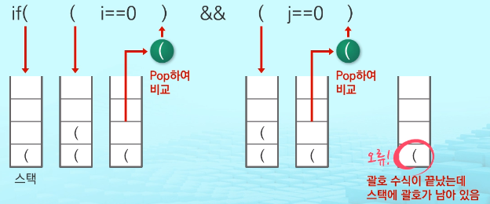
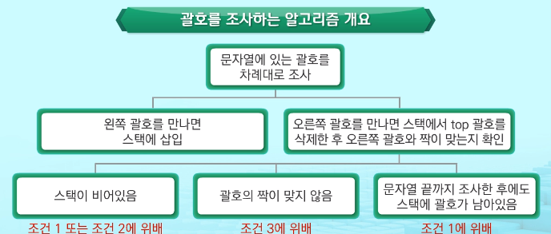
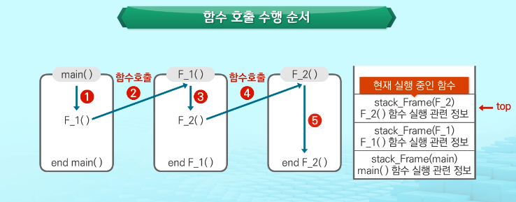

# 01 Stack 자료구조의 개념
## 1. Stack의 특성
### Stack : 프로그램에서 중요성과 활용도가 매우 높은 자료구조
1. 물건을 쌓아 올리듯 자료를 쌓아 올린 형태의 자료구조임
2. 스택에 저장된 자료는 선형구조를 가짐
    - 선형구조: 자료 간의 관계가 1대 1의 관계를 가짐
    - 비선형구조: 자료 간의 관계가 1대 N의 관계를 가짐(예: 트리)
3. 스택에 자료를 삽입하거나 스택에서 자료를 꺼낼 수 있음
4. 마지막에 삽입한 자료를 가장 먼저 꺼냄
5. **후입선출**(LIFO, Last-In-First-Out)이라고 부름
    - 예> 스택에 1, 2, 3순으로 자료를 삽입한 후 꺼내면 역순으로, 즉 3, 2, 1순으로 꺼낼 수 있음

## 2. Stack의 구현
### 자료구조
- 자료를 선형으로 저장할 저장소가 필요함
    - C언어에서는 배열을 사용할 수 있음
    - 파이썬에서는 리스트를 사용할 수 있음
    - 저장소 자체를 스택이라 부르기도 함
    - 스택에서 마지막 삽입된 원소의 위치를 top이라 부름
- 연산
    - 삽입 : 저장소에 자료를 저장하고 보통 push라고 부름
    - 삭제 : 저장소에서 자료를 꺼냄, 꺼낸 자료는 삽입한 자료의 역순으로 꺼냄 보통 pop이라고 부름
    - isEmpty : 스택이 공백인지 아닌지를 확인하는 연산
    - peek : 스택의 top에 있는 item(원소)을 반환하는 연산
    
## 3. Stack의 연산
### 스택의 삽입/삭제 연산 과정

    - 빈 스택에 원소 A, B, C를 차레로 삽입 후 한번 삭제하는 연산 과정
    
    

### push 알고리즘

  ```python
  def push(item):
      s.append(item)
  ```

### pop 알고리즘

  ```python
  def pop():
      if len(s) == 0:
          # underflow
          return
      else:
          return s.pop(-1)
  ```

### 구현하기

1. 스택을 구현하기
2. 구현한 스택을 이용하여 3개의 데이터를 스택에 저장하고 다시 3번 꺼내서 출력하기

  ```python
  def push(item):
   s.append(item)
  def pop():
   if len(s) == 0:
       print("Stack is Empty!!") # underflow
       return
   else:
       return s.pop(-1)
  s = []
  push(1)
  push(2)
  push(3)
  print("pop item =>", pop())
  print("pop item =>", pop())
  print("pop item =>", pop())
  ```

- 스택 구현 고려사항

  - 리스트를 사용하여 스택을 구현하는 경우

    - 장점: 구현이 용이하다는 장점
    - 단점: 리스트의 크기를 변경하는 작업은 내부적으로 큰 overhead 발생 작업으로 많은 시간이 소요

  - 해결 방법

    - 리스트의 크기가 변동되지 않도록 배열처럼 크기를 미리 정해놓고 사용하는 방법
    - 동적 연결리스트를 이용하여 저장소를 동적으로 할당하여 스택을 구현하는 방법

    - 장점: 구현이 용이하다
    - 단점: 리스트로 구현하는 것보다 구현이 복잡함

    

# 02 Stack의 응용

### 괄호검사

- 괄호의 종류

  - 대괄호('[]'), 중괄호('{}'), 소괄호('()')

  - 조건

    1. 왼쪽 괄호의 개수와 오른쪽 괄호의 개수가 같아야 함
    2. 같은 괄호에서 왼쪽 괄호는 오른쪽 괄호보다 먼저 나와야 함
    3. 괄호 사이에는 포함 관계만 존재함

  - 예) 스택을 이용한 괄호 검사

    

    

    

### Fucntion call

- 함수 호출 관리

  프로그램에서의 **함수 호출**과 복귀에 따른 **수행 순서를 관리**

  - 가장 마지막에 호출된 함수가 가장 먼저 실행을 완료하고 복귀하는 **후입선출 구조**이므로, 후입선출 구조의 스택을 이용하여 수행순서 관리
  - 함수 호출이 발생하면 호출한 함수 수행에 필요한 **지역변수, 매개변수 및 수행 후 복귀할 주소 등의 정보를 스택 프레임에 저장**하여 시스템 스택에 삽입
  - 함수의 실행이 끝나면 **시스템 스택의 top 원소(스택 프레임)를 삭제(pop)**하면서 프레임에 저장되어있던 **복귀주소를 확인하고 복귀**
  - 함수 호출과 복귀에 따라 이 과정을 반복하여 전체 프로그램 수행이 종료되면 시스템 스택은 공백 스택이 됨

- 함수 호출 수행 순서
  