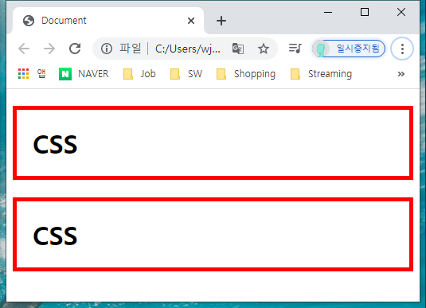
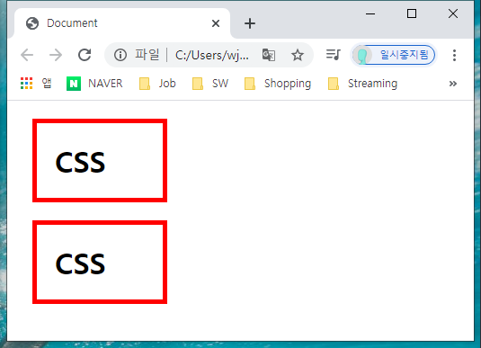
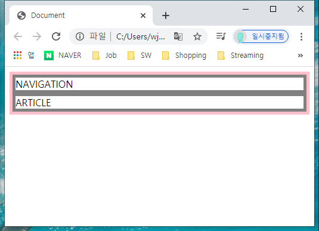
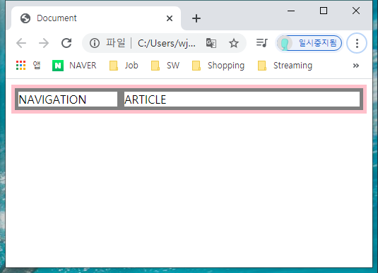
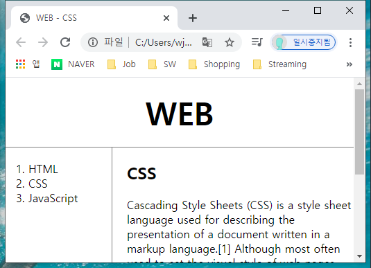
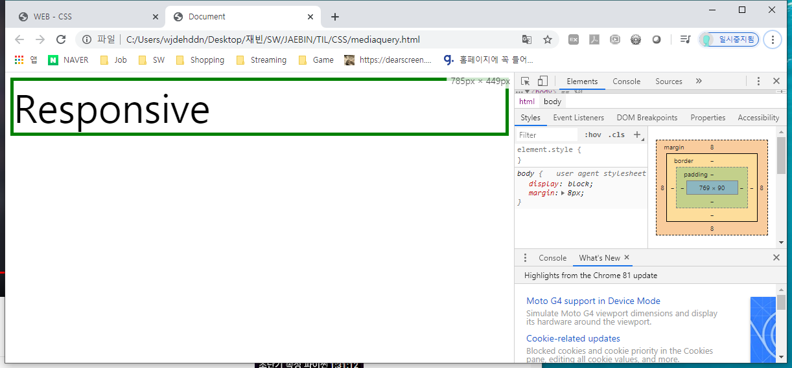
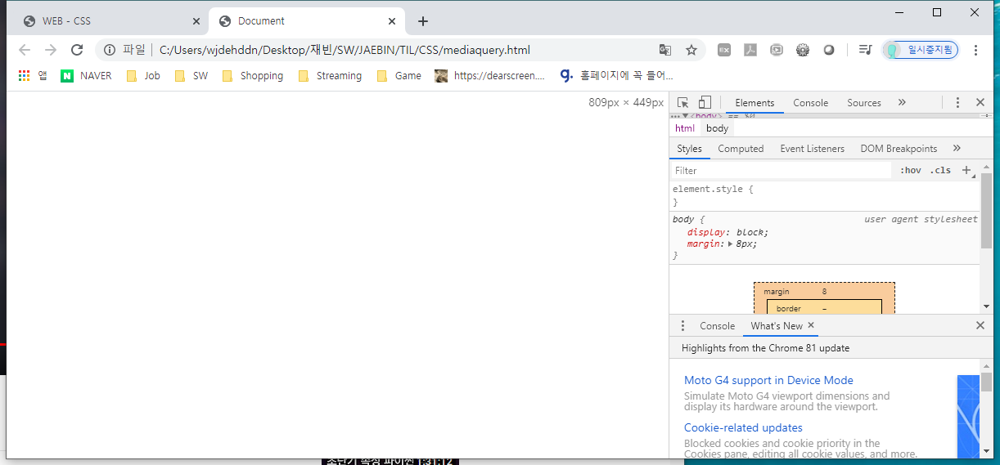

# CSS

> HTML을 이용하면 전자문서를 만들 수 있다. 이는 혁명이었지만 많은 불만이 존재했다. 웹페이지를 보기좋고 아름답게 만드는 방법에 대한 불만족에 대해 집중하며 CSS를 학습한다.


## 기본 문법

```html
<!-- 첫번째 방법 -->
<style>
    a {
        color: black;
        text-decoration: none;
    }
</style>

<!-- 두번째 방법 -->
<a href="" style="color:black; text-decoration:none">A</a>
```

- `a` : Selector

- `color:red;` : Declaration
  - `color`: Property
  - `red` : Value 

**`CSS`, `text`, `size`, `property` 와 같은 키워드를 조합하여 원하는 속성을 검색해서 사용할 수 있다.**


## CSS 선택자의 기본

```html
<style>
    a {
        color: black;
        text-decoration: none;
    }
    .saw {
        color:gray;
    }
    .active {
        color:red;
    }
</style>

<a href="" class="saw">A</a>
<a href="" class="saw active">B</a>
<a href="">C</a>
```

이 처럼 코드를 작성하면 B는 빨간색이 적용된다. `class`는 코드의 작성순서에 따라 스타일이 적용된다.


```html
<style>
    a {
        color: black;
        text-decoration: none;
    }
    .saw {
        color:gray;
    }
    #active {
        color:red;
    }
</style>

<a href="" class="saw">A</a>
<a href="" class="saw" id="active">B</a>
<a href="">C</a>
```

`id` 선택자를 활용하면 `class`선택자나 `tag`선택자보다 우선순위가 적용된다.

사용한 `id` 선택자는 **단 한번만** 등장해야 한다.

좀 더 **구체적인 것**이 포괄적인 것보다 **우선순위가 높다.** (`id` > `class` > `tag(element)`)


## Box Model

h1태그는 기본적으로 화면 전체를 사용한다. 

```html
<style>
    /*
    block level element
    */
    h1 {
        border-width:5px;
        border-color:red;
        border-style:solid;
        display:inline; /* block 태그를 inline 형태로 표시할 수 있다. */
    }
    /*
    inline element
    */
    a {
        border-width:5px;
        border-color:red;
        border-style:solid;
        display:block; /* 마찬가지로 반대도 가능 */
    }
</style>
```


다음과 같이 중복된 코드를 제거할 수 있다.

```html
<style>
    h1, a {
        border-width:5px;
        border-color:red;
        border-style:solid;
        /*
        위의 세 줄을 합치면,
		border:5px solid red;
        */
    }
</style>
```


content와 border 사이에 여백을 주고 싶다면,

```html
<style>
    h1, a {
		border:5px solid red;
        padding:20px;
    }
</style>
```



border 외부에 간격을 주고 싶다면,

```html
<style>
    h1 {
        border:5px solid red;
        padding:20px;
        margin:20px;
        width:100px;
    }
</style>
```




## Grid System

```html
<!DOCTYPE html>
<html lang="en">
<head>
    <meta charset="UTF-8">
    <meta name="viewport" content="width=device-width, initial-scale=1.0">
    <title>Document</title>
    <style>
        #grid{
            border:5px solid pink;
        }
        div {
            border:5px solid gray;
        }
    </style>
</head>
<body>
    <div id="grid">
        <div>NAVIGATION</div>
        <div>ARTICLE</div>
    </div>
</body>
</html>
```

*참고) `<div>`태그는 의미 없는 block element, `<span>`태그는 의미 없는 inline element*




`NAVIGATION` 블럭과 `ARTICLE` 블럭, 두 블럭을 grid system을 이용해서 나란히 놓아보자.

```html
<!DOCTYPE html>
<html lang="en">
<head>
    <meta charset="UTF-8">
    <meta name="viewport" content="width=device-width, initial-scale=1.0">
    <title>Document</title>
    <style>
        #grid{
            border:5px solid pink;
            display:grid;
            grid-template-columns: 150px 1fr;
        }
        div {
            border:5px solid gray;
        }
    </style>
</head>
<body>
    <div id="grid">
        <div>NAVIGATION</div>
        <div>ARTICLE</div>
    </div>
</body>
</html>
```




다음과 같이 적용시켜 볼 수 있다.

```html
<!doctype html>
<html>
<head>
  <title>WEB - CSS</title>
  <meta charset="utf-8">
  <style>
    body{
      margin:0;
    }
    a {
      color:black;
      text-decoration: none;
    }
    h1 {
      font-size:45px;
      text-align: center;
      border-bottom:1px solid gray;
      margin:0;
      padding:20px;
    }
    ol{
      border-right:1px solid gray;
      width:100px;
      margin:0;
      padding:20px;
    }
    #grid{
      display: grid;
      grid-template-columns: 150px 1fr;
    }
    #grid ol{
      padding-left:33px;
    }
    #grid #article{
      padding-left:25px;
    }
  </style>
</head>
<body>
  <h1><a href="index.html">WEB</a></h1>
  <div id="grid">
    <ol>
      <li><a href="1.html">HTML</a></li>
      <li><a href="2.html">CSS</a></li>
      <li><a href="3.html">JavaScript</a></li>
    </ol>
    <div id="article">
        <h2>CSS</h2>
        <p>
          Cascading Style Sheets (CSS) is a style sheet language used for describing the presentation of a document written in a markup language.[1] Although most often used to set the visual style of web pages and user interfaces written in HTML and XHTML, the language can be applied to any XML document, including plain XML, SVG and XUL, and is applicable to rendering in speech, or on other media. Along with HTML and JavaScript, CSS is a cornerstone technology used by most websites to create visually engaging webpages, user interfaces for web applications, and user interfaces for many mobile applications.
        </p>
      </div>
  </div>
  </body>
  </html>
```




## Media Query

> 화면의 크기에 따라 반응하는 Responsive Web 에 대해 학습한다.

```html
<!DOCTYPE html>
<html lang="en">
<head>
    <meta charset="UTF-8">
    <title>Document</title>
    <style>
        div{
            border:5px solid green;
            font-size:60px;
        }
        @media(min-width:800px) {
            div{
                display:none;
            }
        }
    </style>
</head>
<body>
    <div>
        Responsive
    </div>
</body>
</html>
```





**화면의 폭(`px`)에 따라 `media query`를 적용하며 반응형 웹을 구성할 수 있다.**