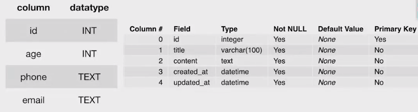

# 데이터베이스(Database, DB)

> **Why DB?**
>
> 데이터베이스는 여러 사람이 공유하여 사용할 못적으로 **체계화해 통합, 관리**하는 데이터의 집합이다.


### DBMS (DB Management System)

- 데이터베이스(DB)를 관리하는(Management) 시스템(System)
- 계층형 데이터베이스, 관계형 데이터베이스, 객체지향 데이터베이스 등이 존재
- **RDBMS**
  - 가장 많이 사용하는 데이터베이스 관리 시스템
  - 관계형 모델을 기반으로 하는 데이터베이스 관리 시스템
  - MySQL, **SQLite**, PostgreSQL, ORACLE, SQLServer


### 관계형 데이터베이스

- 관계형 데이터베이스는 관계를 열과 행으로 이루어진 테이블 집합으로 구성
- 각 열을 특정 종류의 데이터를 기록
- 테이블의 행은 각 객체/엔터티와 관련된 값의 모음


### 기본 용어

- **스키마** : 데이터베이스에서 자료의 구조와 제약 조건(구조, 표현 방법, 관계 등)에 관한 전반적인 명세

  

- **테이블(관계)** : 열과 행의 모델을 사용해 조직된 데이터 요소들의 집합

  

- **Column(열), 속성** : 각 열에는 고유한 데이터 형식이 있다.
- **Row(행), 레코드** : 테이블의 데이터는 행으로 저장된다.
- **PK(Primary Key, 기본키)** : 각 행의 고유값으로 저장된 레코드를 고유하게 식별할 수 있는 값


## SQL(Structured Query Language)

> 관계형 데이터베이스 관리시스템(RDBMS)의 데이터를 관리하기 위해 설계된 특수 목정의 프로그래밍 언어.
>
> RDBMS에서 자료의 검색과 관리, 데이터베이스 스키마 생성과 수정, 데이터베이스 접근 관리 등을 위해 고안 됨.


### 정의

- **DDL(Data Definition Language) - 데이터 정의 언어**
  - 데이터 정의 : 관계형 데이터베이스 구조(테이블, 스키마)를 정의하기 위한 명령어
  - 예시: CREATE, DROP, ALTER
- **DML(Data Manipulation Language) - 데이터 조작 언어**
  - 데이터 저장, 수정, 삭제, 조회 등
  - 예시: INSERT, UPDATE, DELETE, SELECT
- **DCL(Data Control Language) - 데이터 제어 언어**
  - 데이터베이스 사용자의 권한 제어 등
  - 예시 : GRANT, REVOKE, COMMIT, ROLLBACK


```sqlite
$ sqlite3 db.sqlite3
# 앞에 . 이 있는 명령은 SQL문은 아니고, 데이터베이스를 조작하기 위한 명령어
.tables	# 테이블 목록 조회
.schema articles_article # 특정 스키마 활용

SELECT * FROM articles_article; # articles_article 의 모든 데이터 출력
```

*대,소문자 구분이 필요없지만 키워드는 강조를 위해 대문자로 사용한다.*


**SELECT**

- SELECT문은 데이터를 읽어올 수 있으며, 특정한 테이블을 반환한다.

  ```sqlite
  SELECT * FROM table;
  ```

  `*` : 어떤 Column들을 반환할 지 작성 ( `*`은 전체)


### 테이블 조작

- **테이블 생성**

  ```sqlite
  CREATE TABLE table (
  	column1 datatype [constraints],
      column2 datatype [constraints],
      ...,
  );
  ```

  *constraints : PRIMARY KEY, NOT NULL, UNIQUE, DEFAULT 등*


- **Datatype(SQLite)**

  

  ```sqlite
  CREATE TABLE classmates (
  	id INTEGER PRIMARY KEY AUTOINCREMENT,
      name TEXT NOT NULL,
      age INTEGER,
      address TEXT
  );
  ```

  

- **테이블 삭제**

  ```sqlite
  DROP TABLE table;
  ```


### CRUD

- **추가**

  특정 테이블에 새로운 행을 추가하여 데이터를 추가

  ```sqlite
  INSERT INTO table (column1, ...)
  VALUES (value1, ...);
  ```

  ```sqlite
  INSERT INTO classmates (name, age) VALUES ('홍길동', 23);
  ```

  모든 열에 데이터를 넣을 때에는 column을 명시할 필요가 없음

  ```sqlite
  INSERT INTO classmates
  VALUES (2, '홍길동', 30, '서울');
  ```

- **읽기**

  특정 테이블에 특정 레코드를 조회

  ```sqlite
  SELECT * FROM table
  WHERE condition;
  ```

  특정 테이블에 특정 레코드의 특정 column 조회

  ```sqlite
  SELECT column1, ... FROM table
  WHERE condition;
  ```

- **삭제**

  ```sqlite
  DELETE FROM table
  WHERE condition;
  ```

  ```sqlite
  DELETE FROM classmates WHERE id=4;
  ```

- **수정**

  ```sqlite
  UPDATE table
  SET column1 = value1, ...
  WHERE condition;
  ```

  ```sqlite
  UPDATE classmates
  SET name='홍길동', address='제주'
  WHERE id=4;
  ```


### WHERE 조건

- **기본 구문**

  ```sqlite
  SELECT <column> FROM <table>
  [WHERE <condition>]
  [GROUP BY <column>]
  [ORDER BY <column [ASC/DESC]>]
  [LIMIT <integer>];
  ```

  *condition에는 **age >= 18, last_name='김', balance < 100000** 와 같이 활용 가능하다.*

  *AND|OR 을 사용해 조건을 여러개 동시에 걸 수도 있다.*

- **읽기**

  특정 테이블에 특정 레코드의 특정 column조회

  ```sqlite
  SELECT column1, ... FROM table
  WHERE condition;
  ```

  중복 없이 가져오기

  ```sqlite
  SELECT DISTINCT column
  FROM table;
  ```

  ```sqlite
  SELECT DISTINCT name FROM classmates;
  ```

- **표현식**

  특정 테이블에 특정 레코드의 개수

  ```sqlite
  SELECT COUNT(column)
  FROM table;
  ```

  특정 테이블에 특정 레코드의 평균

  ```sqlite
  SELECT AVG(column)
  FROM table;
  ```

  *합 **SUM**, 최소값 **MIN**, 최대값 **MAX***

  

  - 활용

   ```sqlite
  SELECT COUNT(*) FROM classmates;
   ```


### LIKE

> 와일드카드
>
> % : 문자열이 있을 수도 있다.
>
> _ : 반드시 한 개의 문자가 있다.


### ORDER BY

특정 column을 기준으로 정렬

```sqlite
SELECT columns FROM table
ORDER BY column1, column2 ASC|DESC;
```

*ASC(Default) : 오름차순, DECS : 내림차순*


### LIMIT

특정 table에서 원하는 개수만큼 가져오기

```sqlite
SELECT name FROM classmates LIMIT 10;
```

세번째 사람 찾기

```sqlite
SELECT name FROM classmates LIMIT 1 OFFSET 2;
```


### GROUP BY

특정 컬럼을 기준으로 그룹화 하기

```sqlite
SELECT column FROM table
GROUP BY column;
```

```sqlite
SELECT sex, COUNT(name) FROM classmates GROUP BY sex;
```

