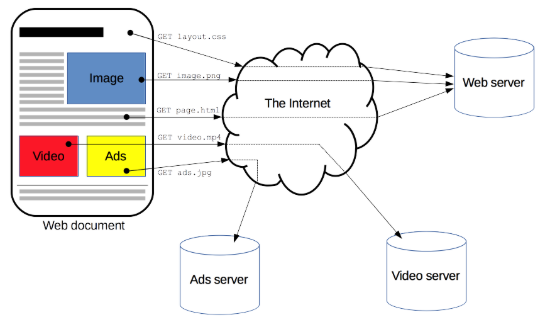
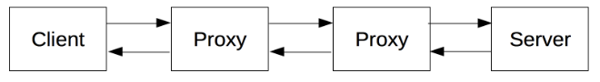
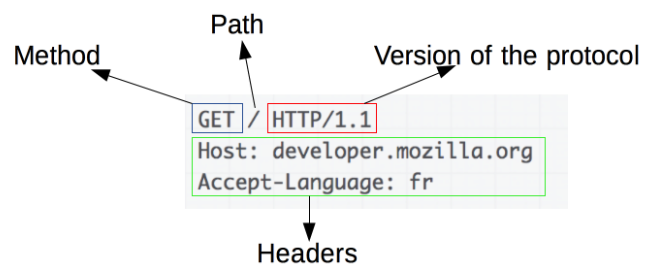
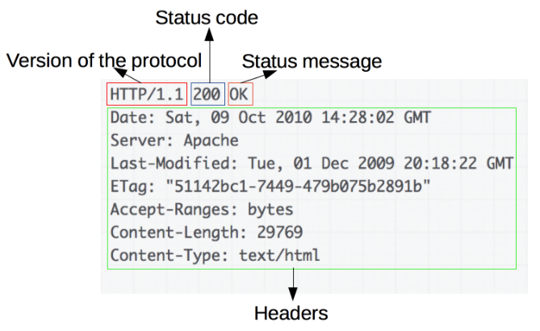

# HTTP

## 1. HTTP 개요

- HTTP는 HTML 문서와 같은 리소스들을 가져올 수 있도록 해주는 **프로토콜**.

  - 프로토콜: 컴퓨터 내부에서, 또는 컴퓨터 사이에서 어떻게 데이터가 교환되는지 정의하는 규칙 체계.
  - 기기 간 통신은 교환되는 데이터 포맷에 대해 상호 합의가 필요한데, 이런 형식을 정의하는 규칙의 집합을 프로토콜이라 한다.

- 웹에서 이루어지는 모든 데이터 교환의 기초이며, **클라이언트-서버 프로토콜**이기도 하다.

  - 클라이언트-서버 프로토콜: 수신자 측에 의해 요청이 초기화되는 프로토콜

    

- 하나의 완전한 문서는 텍스트, 레이아웃 설명, 이미지, 비디오, 스크립트 등 불러온(fetched) 하위 문서들로 재구성 됨
- 클라이언트와 서버들은 개별적인 메시지 교환에 의해 통신한다.
  - 요청(Request): 클라이언트(브라우저)에 의해 전송되는 메시지
  - 응답(Response): 서버에서 응답으로 전송되는 메시지
- HTTP의 확장성 덕분에, 오늘날 하이퍼텍스트 문서 뿐만 아니라 이미지와 비디오 혹은 HTML폼 결과와 같은 내용을 서버로 포스트(POST) 하기 위해서도 사용된다.

### 1.1 HTTP 기반 시스템의 구성요소

- 요청은 하나의 개체, 사용자 에이전트(또는 그것을 대신하는 프록시)에 의해 전송된다.
- 요청과 응답 사이에는 여러 개체들이 있는데, 예를 들면 다양한 작업을 수행하고 게이트웨이 또는 캐시 역할을 하는 프록시 등이 있다.
  - 캐시(Cache): HTTP 응답(Response)들을 일시적으로 저장하는 곳. 이를 통해 그 다음 HTTP 요청(Reauest)들에서 특정 조건이 만족될 때까지 캐시에 저장한 리소스를 사용할 수 있다.

- 실제로는 브라우저와 요청을 처리하는 서버 사이에는 좀 더 많은 컴퓨터들이 존재한다. (라우터, 모뎀 등)
- 웹의 계층적인 설계 덕분에 네트와크와 전송계층 내로 숨겨진다.
- HTTP는 애플리케이션 계층의 최상위에 있다. 네트워크 문제를 진단하는 것도 중요하지만, 기본 레이어들은 HTTP의 명세와는 거의 관련이 없다.

#### 클라이언트: 사용자 에이전트

- 사용자 에이전트는 사용자를 대신하여 동작하는 모든 도구 - 주로 브라우저에 의해 수행된다.

  - 엔지니어들과 자신들의 애플리케이션을 디버스하는 웹 개발자들이 사용하는 프로그램들은 예외

- 브라우저는 항상 요청을 보내는 개체. 결코 서버가 될 수 없다.

- 웹페이지 표시

  1. 브라우저는 페이지의 HTML 문서를 가져오기 위한 요청을 전송
  2. 파일을 구문 분석하여 실행해야 할 스크립트 그리고 페이지 내 포함된 하위 리소스들(보통 이미지와 비디오)을 잘 표시하기 위한 레이아웃 정보(CSS)에 대응하는 추가적인 요청들을 가져옴
  3. 브라우저는 완전한 문서인 웹 페이지를 표시하기 위해 그런 리소스들을 혼합

  - 브라우저에 의해 실행된 스크립트는 이후 단계에서 좀 더 많은 리소스들을 가져올 수 있으며 브라우저는 그에 따라 웹 페이지를 갱신하게 된다.

- 웹 페이지는 하이퍼 텍스트 문서로, 표시된 텍스트의 일부는 사용자가 사용자 에이전트를 제어하고 웹을 돌아다닐 수 있도록 새로운 웹 페이지를 가져오기 위해 실행(보통 마우스 클릭에 의해)될 수 있는 링크임을 뜻한다.

- 브라우저는 HTTP 요청 내에서 이런 지시 사항들을 변환하고 HTTP응답을 해석하여 사용자에게 명확한 응답을 표시한다.

#### 웹 서버

- 통신 채널의 반대편에는 클라이언트에 의한 요청에 대한 문서를 제공하는 **서버**가 존재
- 서버는 사실 상 논리적으로 단일 기계.
- 이는 로드(로드 밸런싱) 혹은 그때 그때 다른 컴퓨터(캐시, DB 서버, e-커머스 서버 등)들의 정보를 얻고 완전하게 혹은 부분적으로 문서를 생성하는 소프트웨어의 복잡한 부분을 공유하는 서버들의 집합일 수도 있기 때문
- 서버는 반드시 단일 머신일 필요는 없지만, 여러 개의 서버를 동일한 머신 위에서 호스팅 할 수는 있다.
- HTTP/1.1과 `Host`헤더를 이용하여 동일한 IP주소를 공유할 수도 있다.

#### 프록시

- 웹 브라우저와 서버 사이에서는 수많은 컴퓨터와 머신이 HTTP 메시지를 이어 받고 전달한다.
- 여러 계층으로 이루어진 웹 스택 구조에서 이러한 컴퓨터/머신들은 대부분은 전송, 네트워크 혹은 물리 계층에서 동작하며, 성능에 상당히 큰 영향을 주지만 HTTP 계층에서는 이들이 어떻게 동작하는지 눈에 보이지 않는다.
- 이러한 컴퓨터/머신 중에서도 애플리케이션 계층에서 동작하는 것들을 일반적으로 **프록시**라고 부른다. 프록시는 눈에 보이거나 그렇지 않을 수도 있으며(프록시를 통해 요청이 변경되거나 변경지되 않는 경우) **다양한 기능**들을 수행할 수 있다.
  - 캐싱: 캐시는 공개 또는 비공개가 될 수 있다.(예: 브라우저 캐시)
  - 필터링: 바이러스 백신 스캔, 유해 컨텐츠 차단(자녀보호) 기능
  - 로드 밸런싱: 여러 서버들이 서로 다른 요청을 처리하도록 허용
  - 인증: 다양한 리소스에 대한 접근 제어
  - 로깅: 이력 정보를 저장

### 1.2 HTTP의 기초적인 측면

#### HTTP는 간단하다.

- HTTP는 사람이 읽을 수 있으며 간단하게 고안되었다.
- HTTP/2가 다소 복잡해졌지만 여전히 HTTP 메세지를 프레임별로 캡슐화하여 간결함을 유지했다.
- HTTP 메시지들은 사람이 읽고 이해할 수 있어, 테스트하기 쉽고 초심자의 진입장벽을 낮췄다.

#### HTTP는 확장 가능하다.

- HTTP/1.0에서 소개된, HTTP 헤더는 HTTP를 확장하고 실험하기 쉽게 만들어주었다.
- 클라이언트와 서버가 새로운 헤더의 시맨틱에 대해 간단한 합의만 한다면, 언제든지 새로운 기능을 추가할 수 있다.

#### HTTP는 상태가 없지만, 세션은 있다.

- HTTP는 상태를 저장하지 않는다.(Stateless)
- 동일한 연결 상에서 연속하여 전달된 두 개의 요청 사이에는 연결고리가 없다.
  - 이는 e-커머스 쇼핑 바구니처럼, 일관된 방식으로 사용자가 페이지와 상호작용하길 원할 때 문제가 된다.
  - 하지만, HTTP의 핵심은 상태가 없는 것이지만 HTTP 쿠키는 상태가 있는 세션을 만들도록 해준다.
  - 헤더 확장성을 사용하여, 동일한 컨텍스트 또는 동일한 상태를 공유하기 위해 각각의 요청들에 세션을 만들도록 HTTP 쿠키가 추가된다.

#### HTTP와 연결

- 연결은 전송 계층에서 제어되므로 근본적으로 HTTP 영역 밖이다.
  - HTTP는 연결될 수 있도록 하는 근본적인 전송 프로토콜을 요구하지 않는다. 다만 신뢰할 수 있거나 메시지 손실이 없는(최소한의 오류는 표시) 연결을 요구할 뿐이다.
  - 인터넷 상의 가장 일반적인 두 개의 전송 프로토콜 중에서 TCP는 신뢰할 수 있으며 UDP는 그렇지 않다. 그러므로 **HTTP는 연결이 필수는 아니지만 연결 기반인 TCP 표준에 의존**한다.

- 클라이언트와 서버가 HTTP를 요청/응답으로 교환하기 전에 여러 왕복이 필요한 프로세스인 TCP 연결을 설정해야 한다.

  - HTTP/1.0의 기본 동작은 각 요청/응답에 대해 별도의 TCP 연결을 여는 것이다. 이 동작은 여러 요청을 연속해서 보내는 경우에는 단일 TCP 연결을 공유하는 것 보다 효율적이지 못하다.
  - 이러한 결함을 개선하기 위해 HTTP/1.1은(구현하기 어렵다고 입증된) 파이프라이닝 개념과 지속적인 연결의 개념을 도입했다.
  - 기본적인 TCP 연결은 `Connection`헤더를 사용해 부분적으로 제어할 수 있다.
  - HTTP/2는 연결을 좀 더 지속되고 효율적으로 유지하는데 도움이 되도록 단일 연결 상에서 메시지를 다중 전송(multiplex)하여 한 걸음 더 나아갔다.

  

### 1.3 HTTP로 제어할 수 있는 것

- HTTP의 확장 가능한 특성은 수년 간에 걸쳐 웹의 더 많은 기능들을 제어하도록 허용되어 왔다.
- 캐시 혹은 인증 메서드는 HTTP에 초기부터 제어해왔던 기능이며, 반면에 `origin` 제약사항을 완화시키는 조치는 2010년에 들으서 추가되었다.

#### HTTP를 사용하여 제어 가능한 일반적인 기능 목록

- 캐시

  HTTP로 문서가 캐시되는 방식을 제어할 수 있다. 서버는 캐시 대상과 기간을 프록시와 클라이언트에 지시할 수 있고, 클라이언트는 저장된 문서를 무시하라고 중간 캐시 프록시에게 지시할 수 있다.

- origin 제약사항을 완화하기

  스누핑과 다른 프라이버시 침해를 막기 위해, 브라우저는 웹 사이트 간의 엄격한 분리를 강제한다. **동일한 origin**으로부터 온 페이지만이 웹 페이지의 전체 정보에 접근할 수 있다.

  그런 제약 사항은 서버에 부담이 되지만, HTTP 헤더를 통해 그것을 완화시킬 수 있다. 그 덕분에 문서는 다른 도메인으로부터 전달된 정보를 패치워크할 수 있다.(어떤 경우에는 보안과 관련된 사항이 있을 수도 있다.)

- 인증

  어떤 페이지들은 보호되어 오로지 특정 사용자만이 그것에 접근할 수도 있다. 기본 인증은 HTTP를 통해 `WWW-Authenticate` 또는 유사한 헤더를 사용해 제공되거나, HTTP 쿠키를 사용해 특정 세션을 설정하여 이루어질 수도 있다.

- 프록시와 터널링

  서버 혹은 클라이언트 혹은 그 둘 모두는 종종 인트라넷에 위치하며 다른 개체들에게 그들의 실제 주소를 숨기기도 한다. HTTP 요청은 네트워크 장벽을 가로지르기 위해 프록시를 통해 나가게 된다. 모든 프록시가 HTTP 프록시는 아니다. 예를 들면 SOCKS 프로토콜은 좀 더 저수준에서 동작한다. FTP와 같은 다른 프로토콜도 이 프록시를 통해 처리될 수 있다.

- 세션

  쿠키 사용을 서버 상태를 요청과 연결하도록 해준다. 이것은 HTTP가 기본적으로 상태 없는 프로토콜임에도 세션을 만들어주는 계기가 된다. 이것은 e-커머스 쇼핑 바구니를 위해서 유용할 뿐만 아니라 사용자 구성을 허용하는 모든 사이트에 대해서 유용하다.

### 1.4 HTTP 메시지

-  HTTP/1.1과 초기 HTTP 메시지는 사람이 읽을 수 있다. HTTP/2에서, 이 메시지들은 새로운 이진 구조인 프레임 안으로 임베드되어, 헤더의 압축과 다중화와 같은 최적화를 가능케 한다.
- 본래의 HTTP 메시지의 일부분만이 이 버전의 HTTP 내에서 전송된다고 할지라도, 각 메시지의 의미들은 변화하지 않으며 클라이언트는 본래의 HTTP/1.1 요청을 (가상으로) 재구성한다.
- 그러므로 HTTP/1.1 포맷 내에서 HTTP/2를 이해하는 것은 여전히 유용하다.

HTTP 메시지의 두 가지 타입인 요청(requests)과 응답(responses)은 각자의 특성있는 형식을 가지고 있다.

#### 요청

- HTTP 요청의 예:

요청은 다음의 요소들로 구성된다.

- HTTP 메서드

  보통 클라이언트가 수행하고자 하는 동작을 정의한 `GET`, `POST` 같은 동사나 `OPTIONS`, `HEAD`와 같은 명사이다.

  일반적으로, 클라이언트는 리소스를 가져오거나(`GET`을 사용하여) HTML 폼의 데이터를 전송(`POST`를 사용하여)하려고 하지만, 다른 경우에는 다른 동작이 요구될 수도 있다.

- 가져오려는 리소스의 경로

  예를 등면 프로토콜(`http://`), 도메인(예: `www.naver.com`), 또는 TCP 포트인 요소들을 제거한 리소스의 URL이다.

- HTTP 프로토콜의 버전

- 서버에 대한 추가 정보를 전달하는 선택적 헤더들

- `POST`와 같은 몇 가지 메서드를 위한, 전송된 리소스를 포함하는 응답의 본문과 유사한 본문

#### 응답

- 응답의 예:

응답은 다음의 요소들로 구성된다.

- HTTP 프로토콜의 버전
- 요청의 성공 여부와, 그 이유를 나타내는 상태 코드
- 아무런 영향력이 없는 상태 코드의 짧은 설명을 나타내는 상태 메시지
- 요청 헤더와 비슷한 HTTP 헤더들
- 선택 사항으로 가져온 리소스가 포함되는 본문

## 2. HTTP 요청 메서드

> HTTP는 요청 메서드를 정의하여, 주어진 리소스에 수행하길 원하는 행동을 나타낸다. 간혹 요청 메서드를 "HTTP 동사"라고 부르기도 한다. 각각의 메서드는 서로 다른 의미를 구현하지만, 일부 기능은 메서드 집합 간에 서로 공유하기도 한다. 이를테면 응답 메서드는 안전하거나, 캐시 가능하거나, 멱등성을 가질 수 있다.

- `GET`

  `GET` 메서드는 특정 리소스의 표시를 요청한다. `GET`을 사용하는 요청은 오직 데이터를 받기만 한다.

- `HEAD`

  `HEAD` 메서드는 `GET` 메서드의 요청과 동일한 응답을 요구하지만, 응답 본문을 포함하지 않는다.

- `POST`

  `POST` 메서드는 특정 리소스에 엔티티를 제출할 때 쓰인다. 이는 종종 서버의 상태 변화나 부작용을 일으킨다.

- `PUT`

  목적 리소스, 모든 현재 표시를 요청 payload로 바꾼다.

- `DELETE`

  특정 리소스를 삭제한다.

- `CONNECT`

  목적 리소스, 식별되는 서버로의 터널을 맺는다.

- `OPTIONS`

  목적 리소스의 통신을 설정하는 데 쓰인다.

- `TRACE`

  목적 리소스의 경로를 따라 메시지 loop-back 테스트를 한다.

- `PATCH`

  리소스의 부분만을 수정하는 데 쓰인다.

## 3. HTTP 상태 코드

> HTTP 응답 상태 코드는 특정 HTTP 요청이 성공적으로 완료되었는지 알려준다. 응답은 5개의 그룹으로 나누어진다.
>
> - 정보를 제공하는 응답
> - 성공적인 응답
> - 리다이렉트
> - 클라이언트 에러
> - 서버 에러

### 3.1 정보 응답

- `100 Continue`

  이 임시적인 응답은 지금까지의 상태가 괜찮으며 클라이언트가 계속에서 요청을 하거나 이미 요청을 완료한 경우에는 무시해도 되는 것을 알려준다.

- `101 Switching Protocol`

  이 코드는 클라이언트가 보낸 `Upgrade` 요청 헤더에 대한 응답에 들어가며 서버에서 프로토콜을 변경할 것임을 알려준다.

- `102 Processing` (WebDAV)

  이 코드는 서버가 요청을 수신하였으며 이를 처리하고 있지만, 아직 제대로 된 응답을 알려줄 수 없음을 알려준다.

- `103 Early Hints`

  이 상태 코드는 주로 `Link` 헤더와 함께 사용되어 서버가 응답을 준비하는 동안 사용자 에이전트가(user agent) 사전 로딩(preloading)을 시작할 수 있도록 한다.

### 3.2 성공 응답

- `200 OK`

  요청이 성공적으로 됨. 성공의 의미는 HTTP 메소드에 따라 달라진다.

  - GET: 리소스를 불러와서 메시지 바디에 전송됨
  - HEAD: 개체 헤더가 메시지 바디에 있음
  - PUT 또는 POST: 수행 결과에 대한 리소스가 메시지 바디에 전송됨
  - TRACE: 메시지 바디는 서버에서 수신한 요청 메시지를 포함하고 있음.

- `201 Created`

  요청이 성공적이었으며 그 결과로 새로운 리소스가 생성됨. 이 응답은 일반적으로 POST 요청 또는 일부 PUT 요청 이후에 따라온다.

- `202 Accepted`

  요청을 수신하였지만 그에 응하여 행동할 수 없음. 이 응답을 요청 처리에 대한 결과를 이후에 HTTP로 비동기 응답을 보내는 것에 대해서 명확하게 명시하지 않는다. 이것은 다른 프로세스에서 처리 또는 서버가 요청을 다루고 있거나 배치 프로세스를 하고 잇는 경우를 위해 만들어졌다.

- `203 Non-Authoritative Information`

  이 응답 코드는 돌려받은 메타 정보 세트가 오리진 서버의 것과 일치하지 않지만 로컬이나 서드 파티 복사본에서 모아졌음을 의미한다. 이러한 조건에서는 이 응답이 아니라 200 OK 응답을 반드시 우선된다.

- `204 No Content`

  요청에 대해서 보내줄 수 있는 콘텐츠가 없지만, 헤더는 의미있을 수 있다. 사용자-에이전트는 리소스가 캐시된 헤더를 새로운 것으로 업데이트 할 수 있다.

- `205 Reset Content`

  이 응답 코드는 요청을 완수한 이후에 사용자 에이전트에게 이 요청을 보낸 문서 뷰를 리셋하라고 알려준다.

- `206 Partial Content`

  이 응답 코드는 클라이언트에서 복수의 스트림을 분할 다운로드를 하고자 범위 헤더를 전송했기 때문에 사용된다.

- `207 Multi-Status` (WebDAV)

  멀티-상태 응답은 여러 리소스가 여러 상태 코드인 상황이 적절한 경우에 해당되는 정보를 전달한다.

- `208 Multi-Status` (WebDAV)

  DAV에서 사용된다. propstat (property와 status의 합성어) 응답 속성으로 동일 컬렉션으로 바인드된 복수의 내부 멤버를 반복적으로 열거하는 것을 피하기 위해 사용된다.

- `226 IM used` (HTTP Delta encoding)

  서버가 GET 요청에 대한 리소스의 의무를 다 했고, 응답이 하나 또는 그 이상의 인스턴스 조작이 현재 인스턴스에 적용이 되었음을 알려준다.

### 3.3 리다이렉션 메시지

### 3.4 클라이언트 에러 응답

- `400 Bad Request`

  이 응답은 잘못된 문법으로 인하여 서버가 요청을 이해할 수 없음을 의미한다.

- `401 Unauthorized`

  비록 HTTP 표준에서는 "미승인(unauthorized)"를 명확히 하고 있지만, 의미상 이 응답은 "비인증(Unauthenticated)"을 의미한다. 클라이언트는 요청한 응답을 받기 위해서는 반드시 스스로를 인증해야 한다.

- `403 Forbidden`

  클라이언트는 콘텐츠에 접근할 권리를 가지고 있지 않다. 예를들어 그들은 미승인이어서 서버는 거절을 위한 적절한 응답을 보낸다. 401과 다른 점은 서버가 클라이언트가 누구인지 알고 있다.

- `404 Not Found`

  서버는 요청받은 리소스를 찾을 수 없다. 브라우저에서는 알려지지 않은 URL을 의미한다. 이것은 API에서 종점은 적절하지만 리소스 자체는 존재하지 않음을 의미할 수도 있다. 서버들은 인증받지 않은 클라이언트로부터 리소스를 숨기기 위해 이 응답을 403 대신 전송할 수도 있다.

### 3.5 서버 에러 응답

- `500 Internal Server Error`

  서버가 처리 방법을 모르는 상황과 마주쳤다. 서버는 아직 처리 방법을 알 수 없다.

- `501 Not Implemented`

  요청 방법은 서버에서 지원되지 않으므로 처리할 수 없다. 서버가 지원해야 하는 유일한 방법은 `GET`와 `HEAD` 이다. 이 코드는 반환하면 안된다.

- `502 Bad Gateway`

  이 오류 응답은 서버가 요청을 처리하는 데 필요한 응답을 얻기 위해 게이트웨이로 작업하는 동안 잘못된 응답을 수신했음을 의미한다.

- `503 Service Unvailable`

  서버가 요청을 처리할 준비가 되지 않았다. 일반적인 원인은 유지보수를 위해 작동이 중단되거나 과부하가 걸린 서버다. 이 응답과 함께 문제를 설명하는 사용자 친화적인 페이지가 전송되어야 한다는 점에 유의하십시오. 이 응답은 임시 조건에 사용되어야 하며, `Retry-After:` HTTP 헤더는 가능하면 서비스를 복구하기 전 예상 시간을 포함해야 한다. 웹마스터는 또한 이러한 일시적인 조건 응답을 캐시하지 않아야 하므로 이 응답과 함께 전송되는 캐싱 관련 헤더에 대해서도 주의해야 한다.

## 4. HTTP 쿠키

HTTP 쿠키(웹 쿠키, 브라우저 쿠키)는 서버가 사용자의 웹 브라우저에 전송하는 작은 데이터 조각이다. 브라우저는 그 데이터 조각들을 저장해 놓았다가 동일한 서버에 재 요청 시 저장된 데이터를 함께 전송한다. 쿠키는 두 요청이 동일한 브라우저에서 들어왔는지 아닌지를 판단할 때 주로 사용한다. 이를 이용하면 사용자의 로그인 상태를 유지할 수 있다. 상태가 없는(stateless) HTTP 프로토콜에서 상태 정보를 기억시켜주기 때문이다.

쿠키는 주로 세 가지 목적을 위해 사용된다.

1. **세션 관리 (Session Management)**

   서버에 저장해야 할 로그인, 장바구니, 게임 스코어 등의 정보 관리

2. **개인화 (Personalization)**

   사용자 선호, 테마 등의 세팅

3. **트래킹 (Tracking)**

   사용자 행동을 기록하고 분석하는 용도

과거에는 클라이언트 측에 정보를 저장할 때 쿠키를 주로 사용하곤 하였다. 쿠키를 사용하는 게 데이터를 클라이언트 측에 저장할 수 있는 유일한 방법이었을 때는 이 방법이 타당했지만, 지금은 modem storage APIs를 사용해 정보를 저장하는 걸 권장한다. 모든 요청마다 쿠키가 함께 전송되기 때문에, (특히 mobile data connections에서) 성능이 떨어지는 원인이 될 수 있다. 정보를 클라이언트 측에 저장하려면 Modem APIs의 종류인 웹 스토리지 API (`localStorage`와 `sessionStorage`)와 IndexedDB를 사용하면 된다.

*저장된 쿠키(그리고 웹 페이지가 사용할 수 있는 다른 스토리지)를 보려면 개발자 도구에서 Storage Inspector(스토리지 검사기)를 활성화하고 스토리지 트리에서 쿠키 스토리지를 선택하면 된다.*